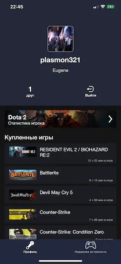
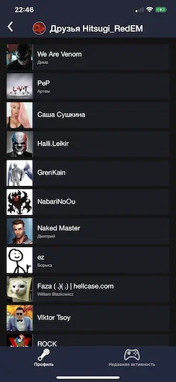
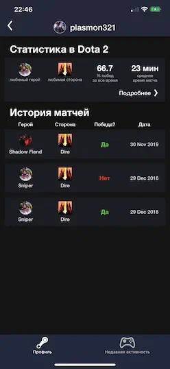
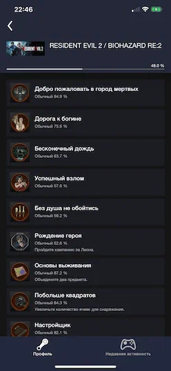

# SteamFunClient

## Описание и функционал приложения

Приложение представляет собой клиент популярного игрового сервиса Steam.
При запуске пользователю предлагается авторизоваться в Steam под своим профилем, после чего авторизованный пользователь попадает на экран своего профиля, на котором отображается имя и аватарка пользователя из Steam и список его купленных игр.

С профиля можно перейти на :
* список друзей пользователя, из которого тапом по ячейке друга можно открыть профиль друга с аналогичным функционалом:

* экран игровой статистики в Dota 2:

* список достижений в выбранной купленной игре:

Экран игровой статистики в Dota 2 содержит:
* краткую сводку игровой активности пользователя (процент побед, наиболее часто выбираемую сторону и героя, среднюю длительность матча);
* список сыграннных матчей.

Нажатие на ячейку краткой сводки открывает экран подробной игровой статистики. Целью этого экрана является показать пользователю его активность и прогресс в игре, наиболе удачно используемых героев.

Приложение содержит два таба:
1. Профиль
1. Недавняя активность.

На табе недавней активности отображаются игры, в которые пользователь играл за последние 2 недели, и время, проведенное в них.

## Архитектура кодовой базы

* Для верхнего уровня приложения используется модульная архитектура MVP с `UIViewController` в качестве слоя `View`. Общение между `View` и `Presenter` происходит посредством протоколов `ViewInput` и `ViewOutput`, а для сборки MVP-модуля используется класс `Builder`, проставляющий зависимости. MVP-модули, представляющие собой экраны приложения, находятся в папке `Flows`
* Навигационный стек приложения использует нативные `UITabbarController` и `UINavigationController`. Navigation bar на каждом экране реализован кастомно, нативный отключен. Используется нативный жест свайпа назад и стандартная анимация перехода между контроллерами.
* Декодинг ответов от сервера в структуры и классы происходит с помощью протокола `Decodable`. Код этих структур и классов находится в папке `Entities`.
* В папке `Core` находятся классы-сервисы, работающие с сетью и базой данных, и фасады на основе них, предоставляющие интерфейсы для клиентского кода. Часть кода написана в функциональном стиле, с использованием монад (см. `Core/Operators/Monads.swift`).
* Авторизация нужна только для того, чтобы сохранить steamID текущего пользователя. При нажатии кнопки "Выйти" на профиле данные о steamID текущего пользователя стираются, и авторизацию надо пройти заново.
* После авторизации под пользователем или после захода в приложение уже авторизованным пользователем для текущего пользователя в фоновом режиме стартует выкачка данных о матчах Dota 2 этого пользователя. При заходе на экран Dota 2 загрузка либо уже идет, либо закончена. Для другого пользователя (!= авторизованному) скачка матчей начнет происходить только при заходе на экран Dota 2. Все данные о скачанных матчах сохраняются в БД и используются как при текущей сессии приложения, так и после перезапуска. При новом запуске приложения скачка данных будет стартовать снова, но только тех матчей, которые еще не сохранены в БД.
* Переиспользуемые UI-компоненты, палитра цветов и шрифтов находятся в папке `UI`.
* Приложение поддерживает темную и светлую тему. Для этого написана обертка `themeDependent`, которая позволяет задать цвет компонента отдельно для темной и светлой темы.
* Минимальная поддерживаемая версия iOS: 10.0.
* Внешние зависимости проекта подключаются через CocoaPods. Использованные зависимости:
  - [`SnapKit`](https://github.com/SnapKit/SnapKit) для удобной вёрстки в коде. Использование нативных `NSLayoutConstraint.init` и `anchors` добавляет много boilerplate-кода, а `SnapKit` значительно нивелирует эту проблему.
  - [`Kingfisher`](https://github.com/onevcat/Kingfisher) для подгрузки картинок из сети. Написать собственный велосипед-загрузчик картинок несложно, но на это просто нет времени в таком проекте.
  - [`Alamofire`](https://github.com/Alamofire/Alamofire). Опять же, просто удобный и элегантный инструмент, который добавляет такую нужную "swifty" прослойку между кодом, совершающим запросы в сеть, и нативным `NSURLSession`.
  - [`Realm`](https://github.com/realm/realm-cocoa) для персистентного хранения данных локально на устройстве. В сравнении с `CoreData`, в первую очередь, `Realm` гораздо быстрее просто начать использовать. Сами модели базы данных ближе к привычным объектам, а также в `Realm` удобнее реализовано API для миграций БД. По этим причинам в проекте используется именно `Realm`.

## Использованные методы API Steam:
  - `api.steampowered.com/ISteamUser/GetPlayerSummaries/v0002`
  (Экраны: Профиль, Список друзей)
  - `api.steampowered.com/ISteamUser/GetFriendList/v0001`
  (Экраны: Профиль, Список друзей)
  - `api.steampowered.com/IPlayerService/GetOwnedGames/v0001`
  (Экраны: Профиль)
  - `api.steampowered.com/ISteamUserStats/GetPlayerAchievements/v0001`
  (Экраны: Достижения в купленной игре)
  - `api.steampowered.com/ISteamUserStats/GetGlobalAchievementPercentagesForApp/v0002`
  (Экраны: Достижения в купленной игре)
  - `api.steampowered.com/ISteamUserStats/GetSchemaForGame/v2`
  (Экраны: Достижения в купленной игре)
  - `api.steampowered.com/IPlayerService/GetRecentlyPlayedGames/v0001`
  (Экраны: Недавняя активность)
  - `api.steampowered.com/IEconDOTA2_570/GetHeroes/v1`
  (Запрашивается на старте приложения)
  - `api.steampowered.com/IDOTA2Match_570/GetMatchHistory/v1`
  (Экраны: Статистика и история матчей Dota 2)
  - `api.steampowered.com/IDOTA2Match_570/GetMatchDetails/v1`
  (Экраны: Статистика и история матчей Dota 2)

## План дальнейшего развития проекта

### Архитектурное и техническое развитие

* **График**.
  * Текущая реализация заточена под конкретный график зависимости. Необходимо более универсальное решение:
    * `PlotPoint` и `PlotModel` должны быть независимы от типа оси x.
    * Абстрагировать отображение осей, и реализовать возможность их настройки.
  * Улучшить реализацию жестов. Они должны удовлетворять потребностям хорошего UX.
  * Отрефакторить с учетом принципа single responsibility. Сейчас сам интерфейс графика представляет собой класс `Plot` - наследник `UIView`. В нем есть логика отображения значений, логика обработки жестов, он же является dataSource-ом для осей и полотна графика. При обрастании новой функциональностью необходимо лучшее разделение обязанностей, иначе систему классов графика будет трудно поддерживать.
  * Улучшить отображение линии графика. Давать возможность через интерфейс настроить тип интерполяции линии графика (сплайны).
* **Авторизация через OpenID**
* **Кэшировать запросы**. Большинство запросов, отправляемых в Steam, можно кэшировать на некоторое небольшое время, так как постоянные изменения в них не ожидаются (например, изменение списка купленных игр происходит нечасто), чтобы ускорить и оптимизировать работу приложения.
* **Errors**. Типизация ошибок, сохранение underlying ошибок. Поскольку API Steam может отвечать неожиданными response на запросы (например, внезапно вернуть пустой объект json) или вовсе не отвечать, то важно понимать в таком случае, из-за чего в приложении происходят определенные вещи, а для этого поможет улучшение механизма перехвата и обработки ошибок.
* **Unit-tests**.
  * Тесты на декодинг моделей. Особенно актуально для моделей матчей и статистики игр, в которых возможно добавление новых полей.
  * Тесты на преобразование данных моделей в данные для отображения графика.
  * Тесты на расчет данных для графика при нестандартных ситуациях: большой разрыв в истории матчей, мало матчей, в матчах только победы или только поражения и т.д.
  * Тесты на отработку логики композитных запросов. Например, `Dota2MatchesRequestManager` для получения готовых данных запрашивает несколько GetMatchHistory и большое количество GetMatchDetails. Проверить работу этого класса для разных случаев ответов сервера.
* **Модуляризация**.
  * `ExpandableNavbar` является переиспользуемым UI-компонентом, который можно подключить как зависимость и развивать отдельно (в т.ч. в формате open-source).
  * График выделить в отдельный модуль.
* **Routing**. Код и логика по открытию экранов (кроме тех, что инициируются в  `InitialCoordinator` - авторизация и таббар) находится в `Presenter`-ах конкретных модулей. Это ок в текущей ситуации с не очень большим количеством экранов. С ростом сложности навигации по приложению может понадобиться более гибкое решение, например, паттерн координатор или с помощью роутеров.
* **Улучшение БД**.
  * Детали матчей Dota 2 сохраняются и запрашиваются в БД по конкретному юзеру. Организовать такую систему хранения матчей в БД, что общие матчи нескольких юзеров хранятся в одном экземпляре.
  * Если произошла ошибка при запросе MatchDetails, то сохранять эту ошибку в БД и по возможности перезапрашивать инфу.

### Продуктовое развитие

* Экран подробной статистики по Dota 2.
  * На графике прогресса игрока (% побед в зависимости от времени) добавить возможность выбрать героя, для которого отображать график, а также несколько героев (не более 5), чтобы сравнить прогресс на них.
  * Адаптивная ось X: отображать даты вплоть с точностью до дня, в зависимости от масштаба графика.
  * Улучшения логики расчета % побед с учетом активности игрока в разные промежутки времени.
  * Возможность посмотреть показатели kills/deaths/assists для выбранного героя в зависимости от времени.
  * Pie-диаграмма частоты выбора роли в игре (керри, лесник, саппорт и т.д.)
* Список сыгранных матчей Dota 2. При тапе на ячейку в таблице раскрывается подробная информация о матче: список героев и ников игроков у каждой стороны, для каждого игрока выводится количество убийств, смертей, ассистов, ластхитов и денаев, а также полученный уровень героя.
* На экран недавней активности добавить последние сыгранные матчи в Dota 2, Counter-Strike, PUBG.
* Тап по игре из списка купленных игр ведет на разводящую страницу игры, с которой можно перейти на экран достижений (реализовано), новости по игре, информацию из Steam Store по игре.
* Статус онлайн и дата последнего нахождения онлайн на профиле и списке друзей.
